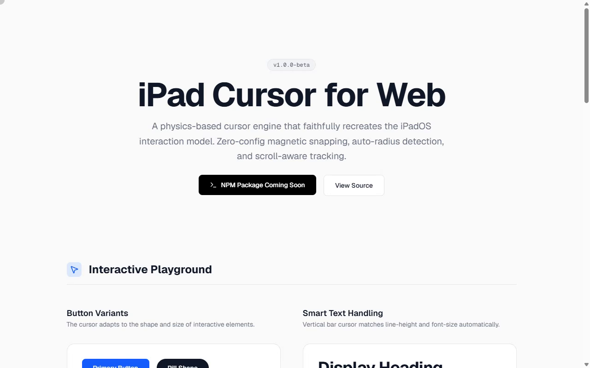

# iPadOS cursor for Next.js

A React implementation of an iPadOS-style pointer. The cursor follows the mouse as a dot, expands around interactive blocks, and becomes a vertical bar over text targets.



[Live demo](https://ipados-cursor.vercel.app)

## Run locally

Use Node.js 22 and pnpm.

```bash
git clone https://github.com/SpyC0der77/ipados-cursor-nextjs.git
cd ipados-cursor-nextjs
pnpm install --frozen-lockfile
pnpm dev
```

Open [localhost:3000](http://localhost:3000). Use `pnpm build` followed by `pnpm start` for a production build, and `pnpm lint` for ESLint. No API key or backend is required.

## Add it to a page

Mount `CursorProvider` and `Cursor` around the content, as in [`src/app/layout.tsx`](src/app/layout.tsx):

```tsx
import { CursorProvider } from "@/components/cursor/CursorProvider";
import { Cursor } from "@/components/cursor/Cursor";
import { CursorTarget } from "@/components/cursor/CursorTarget";

export function CursorDemo() {
  return (
    <CursorProvider>
      <Cursor />
      <CursorTarget>
        <button>Hover here</button>
      </CursorTarget>
      <CursorTarget type="text">
        <p>Text cursor target</p>
      </CursorTarget>
    </CursorProvider>
  );
}
```

Use this component within a client component. The `@/` imports assume this project's alias configuration.

| `CursorTarget` prop | Default | Behavior |
| --- | --- | --- |
| `type` | `"block"` | Choose a block or text target |
| `magnetic` | `true` | Allow the magnetic interaction |
| `stickiness` | `false` | Use the configured strict tracking behavior |
| `className` | Unset | Apply classes to the target wrapper |

## Configuration

Edit [`cursorConfig.ts`](src/components/cursor/cursorConfig.ts) to change padding, springs, colors, magnetic strength, and click behavior. The current magnetic strength is `0.2`. Block targets adapt to element border radii; text targets use the text line height.

The implementation uses the `motion` package, React 19, Next.js 16, and Tailwind CSS 4. It is intended for mouse and pointer interaction; a static screenshot cannot show the magnetic movement.

## Documentation and credits

The [`docs/`](docs/) folder contains usage, configuration, and API documentation. The implementation is inspired by [CatsJuice/ipad-cursor](https://github.com/CatsJuice/ipad-cursor). See [`docs/LICENSE`](docs/LICENSE) for the license included with the documentation.
